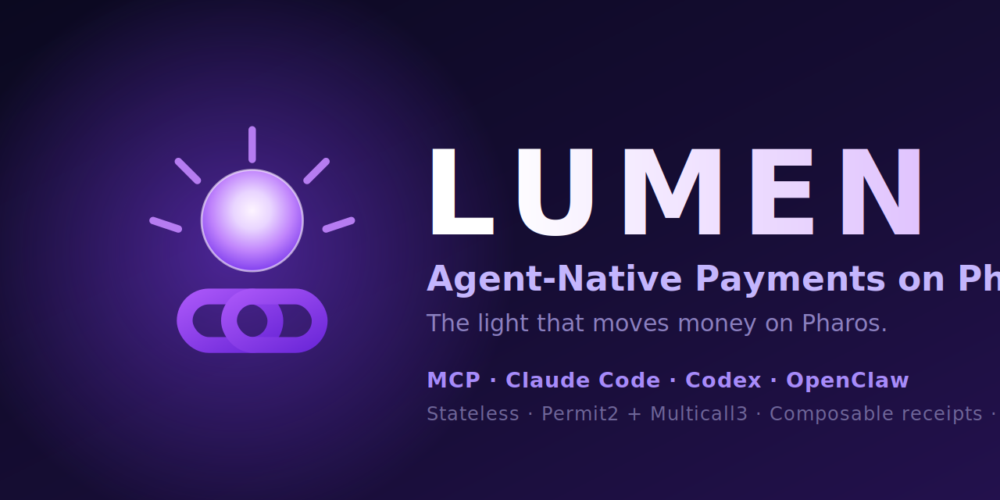

# Lumen — Agent-Native Payments on Pharos

> *"The light that moves money on Pharos."*

[](https://github.com/ahmadstiff/lumen/actions/workflows/ci.yml)


Lumen is a payment **skill** — not an app, not a service — that lets AI agents
move money on Pharos with structured JSON, composable receipts, and **zero
custom contract deployments**.

It ships as four runtimes from a single source tree: **Claude Code**,
**Codex CLI**, **OpenClaw**, and a TypeScript **MCP server** for Claude
Desktop / Cursor / VS Code agent mode.

> 📨 **Hackathon submission brief:** see [`docs/HACKATHON.md`](docs/HACKATHON.md)
> for the explicit mapping to Pharos Phase 1 judging criteria, and
> [`docs/PHASE2.md`](docs/PHASE2.md) for concrete Phase 2 agent mockups.

## Why Lumen exists

Most "AI payments" projects bolt an agent on top of a Web3 SDK. Lumen flips
the model: every capability is designed from the ground up for agent-native
consumption — same JSON in, same JSON out, deterministic error codes,
append-only audit ledger, zero custom on-chain surface.

## The six moats

| # | Moat | What it means in code |
|---|---|---|
| 1 | **Agent-native by design** | Every script reads JSON on stdin, writes JSON on stdout, emits machine-codeable errors. No interactive prompts. |
| 2 | **Stateless architecture** | We compose Permit2 + Multicall3 + EIP-712. **Zero** custom contract is deployed. |
| 3 | **Composable receipts** | Each call writes a normalized receipt to `.lumen/ledger.ndjson` and emits MD + JSON + CSV. |
| 4 | **Skill-Scanner first** | Unlimited approvals refused, raw private keys blocked on mainnet, no shell `eval`, 365-day expiry cap, tip-amount ceiling. |
| 5 | **Agent-to-Agent primitives** | `invoice`, `pay.recurring`, `pay.escrow`, `pay.tip` exchange EIP-712 docs between agents, no central server. |
| 6 | **Multi-framework distribution** | Claude Code, Codex CLI, OpenClaw, **MCP** — same skill files, four runtimes. |

## Capabilities (P0 + P1 + P2)

| Capability         | Tier | Script                          | Reference                              |
|--------------------|------|---------------------------------|----------------------------------------|
| `pay.once`         | P0   | `scripts/pay.once.sh`           | `references/pay.once.md`               |
| `pay.split`        | P0   | `scripts/pay.split.sh`          | `references/pay.split.md`              |
| `approval.scope`   | P0   | `scripts/approval.scope.sh`     | `references/approval.scope.md`         |
| `receipt.generate` | P0   | `scripts/receipt.generate.sh`   | `references/receipt.generate.md`       |
| `invoice`          | P1   | `scripts/invoice.sh`            | `references/invoice.md`                |
| `pay.recurring`    | P1   | `scripts/pay.recurring.sh`      | `references/pay.recurring.md`          |
| `ledger.query`     | P1   | `scripts/ledger.query.sh`       | `references/ledger.query.md`           |
| `pay.escrow`       | P2   | `scripts/pay.escrow.sh`         | `references/pay.escrow.md`             |
| `pay.tip`          | P2   | `scripts/pay.tip.sh`            | `references/pay.tip.md`                |
| `intent.parse`     | P2   | `scripts/intent.parse.sh`       | *(inline docs in script)*              |

Also shipped: `mcp-server/` — a TypeScript MCP server that re-exposes every
capability above as an MCP tool with the same name. See
[`docs/MCP.md`](docs/MCP.md).

## Demo

> 🎥 **Demo video:** *(coming with submission — link will appear here)*.
> Shot list: [`docs/DEMO_SCRIPT.md`](docs/DEMO_SCRIPT.md) ·
> slide script: [`docs/PITCH_DECK.md`](docs/PITCH_DECK.md).
>
> ▶️ **Reproduce locally:** [`examples/demo-flow.sh`](examples/demo-flow.sh)
> (offline `intent.parse` + opt-in live flow). For recording, use the paced
> one-command [`examples/record-demo.sh`](examples/record-demo.sh); see
> [`examples/README.md`](examples/README.md).

A typical end-to-end agent flow:

```text
agent: "send 10 USDC to 0x7099…79C8, then split 5% of incoming royalties
        between three contributors, and remind me with a Markdown receipt."

  ├── intent.parse  →  best_match: pay.once  (confidence 85)
  ├── pay.once       →  tx 0xabc… (Atlantic)  · receipt md+json+csv
  ├── approval.scope (mode=permit2 → Multicall3)  →  tx 0xdef…
  ├── pay.split (mode=multicall)  →  one atomic tx 0xfaa…
  └── receipt.generate (tx=0xfaa…)  →  receipt.md / .json / .csv
```

The same flow works under Claude Code, Codex CLI, OpenClaw, **and** any
MCP client.

### Live proof (Atlantic testnet)

A real end-to-end run on Pharos Atlantic (chain 688689):

- MockERC20 test token deploy — [`0x794c…8816`](https://atlantic.pharosscan.xyz/tx/0x794c39e852518ea2480ab876bce916fc773fb7a7e4327f9c2b98883071068816) (token [`0x4Cdc…D4E9`](https://atlantic.pharosscan.xyz/address/0x4Cdc17C2738224b282153572ef052E661086D4E9))
- Lumen `pay.once` — 1 lUSD ERC-20 transfer — [`0xdabf…3148`](https://atlantic.pharosscan.xyz/tx/0xdabf122f424dd02c16631ba909b8b5614e502d73a1a8736726957551e6573148), decoded by `receipt.generate` and audited by `ledger.query`

See [`docs/HACKATHON.md`](docs/HACKATHON.md) §5 for the full criteria mapping.

## 60-second quick start

```bash
# 0. Prereqs — macOS ships bash 3.2, but Lumen needs bash >= 4:
#      brew install bash foundry jq shellcheck markdownlint-cli bc node
#    foundryup && foundryup install stable

# 1. Build helper Solidity library + run tests
forge install foundry-rs/forge-std --no-git --shallow --root contracts
forge test --root contracts            # expect 24 passed

# 2. Configure a wallet (testnet)
cp .env.example .env
$EDITOR .env                           # pick network + one of keystore/account/private key

# 3. Send a payment (Lumen bash skill)
echo '{
  "network": "atlantic",
  "idempotency_key": "demo-1",
  "params": {
    "token": "0xUSDC…",
    "recipient": "0x70997970…",
    "amount": "1000000",
    "memo": "hello pharos"
  }
}' | scripts/pay.once.sh | jq

# 4. (Optional) Run the MCP server so Claude Desktop / Cursor can call it
cd mcp-server && npm install && npm run build
node dist/index.js                      # speaks JSON-RPC on stdio
```

See [`docs/MCP.md`](docs/MCP.md) for wiring the MCP server into Claude
Desktop, Cursor, Claude Code, or VS Code agent mode.

## Distribution targets

Same source tree, four agent runtimes:

1. **Claude Code** — drop the repo into `.claude/skills/lumen/` or symlink.
2. **Codex CLI** — plain bash scripts, no wrapper needed.
3. **OpenClaw** — `SKILL.md` frontmatter is OpenClaw-compatible.
4. **MCP server** — `cd mcp-server && npm install && npm run build`, then
   register `dist/index.js` in your MCP client config. Each Lumen capability
   appears as a typed MCP tool with the same name (`pay.once`, `pay.split`,
   `pay.escrow`, …).

## Repository layout

```text
.
├── SKILL.md                  # Anthropic skill manifest (capability index)
├── README.md                 # this file
├── assets/
│   └── networks.json         # Pharos Atlantic + Pacific RPC, explorer, well-knowns
├── contracts/                # Foundry project
│   ├── foundry.toml          # Optimizer, fuzz, fmt profile
│   ├── src/LumenLib.sol      # Pure helper library — EIP-712 digests + BPS math
│   └── test/LumenLib.t.sol   # 24 tests (unit + fuzz invariants)
├── docs/
│   ├── ARCHITECTURE.md       # C4 + sequence diagrams (Mermaid)
│   ├── SECURITY.md           # T1–T14 threat matrix
│   ├── CAPABILITIES.md       # Consolidated capability guide
│   ├── MCP.md                # MCP-server wiring guide
│   ├── HACKATHON.md          # Pharos Phase 1 submission brief
│   ├── PHASE2.md             # Phase 2 agent mockups
│   ├── DEMO_SCRIPT.md        # 2–4 min demo video shot list
│   └── PITCH_DECK.md         # slide-by-slide pitch deck script
├── references/               # One reference doc per capability
│   ├── pay.once.md           # P0
│   ├── pay.split.md          # P0
│   ├── approval.scope.md     # P0
│   ├── receipt.generate.md   # P0
│   ├── invoice.md            # P1
│   ├── pay.recurring.md      # P1
│   ├── ledger.query.md       # P1
│   ├── pay.escrow.md         # P2
│   └── pay.tip.md            # P2
├── scripts/                  # Capability scripts (bash)
│   ├── lib/common.sh         # Shared library (logging, JSON, bignum, ledger)
│   ├── pay.once.sh           # P0
│   ├── pay.split.sh          # P0
│   ├── approval.scope.sh     # P0
│   ├── receipt.generate.sh   # P0
│   ├── invoice.sh            # P1
│   ├── pay.recurring.sh      # P1
│   ├── ledger.query.sh       # P1
│   ├── pay.escrow.sh         # P2
│   ├── pay.tip.sh            # P2
│   └── intent.parse.sh       # P2
├── examples/                 # Runnable demo + request fixtures
│   ├── demo-flow.sh          # One-command end-to-end (offline + live)
│   ├── record-demo.sh        # Paced presenter script for the demo video
│   ├── deploy-test-token.sh  # Deploy a throwaway ERC-20 test token
│   ├── requests/             # One JSON request body per capability
│   └── README.md             # How to run offline + go live on Atlantic
├── mcp-server/               # TypeScript MCP server (stdio)
│   ├── src/                  # 1 file per tool + runner + paths + server
│   └── README.md             # Setup, smoke test, Claude Desktop wiring
└── .lumen/                   # per-user runtime state (gitignored)
    ├── ledger.ndjson         # append-only audit ledger
    ├── receipts/<tx>/        # MD + JSON + CSV per transaction
    └── queries/<ts>/         # MD + JSON + CSV per ledger.query call
```

## Network support

- **Pharos Atlantic Testnet** — chain id 688689, RPC `https://atlantic.dplabs-internal.com`
- **Pharos Pacific Mainnet** — chain id 1672, RPC `https://rpc.pharos.xyz`

Switch via `LUMEN_NETWORK` env var or `"network"` field in any request.
Canonical Permit2 and Multicall3 are pre-wired in `assets/networks.json`.

## Security posture

Read [`docs/SECURITY.md`](docs/SECURITY.md) before granting Lumen any
allowances. Highlights:

- `approval.scope` refuses `uint256.max` and requires a future `expiry_unix`
  within a 365-day cap.
- Raw `LUMEN_PRIVATE_KEY` is **forbidden on mainnet** — use `LUMEN_KEYSTORE`
  or `cast wallet`-managed accounts.
- `pay.tip` caps single tips at `1e22` base units; larger transfers must use
  `pay.once`.
- All capabilities write to `.lumen/ledger.ndjson` and replay idempotently
  on a repeated `idempotency_key`.
- No `eval`, no `bash -c "$INPUT"`, no arbitrary network endpoints — only
  RPCs declared in `assets/networks.json` or `LUMEN_RPC_URL`.

## Status & gates

| Gate                                   | Result                                          |
|----------------------------------------|-------------------------------------------------|
| `forge test --root contracts`          | **24 passed**, 0 failed, 0 skipped              |
| `shellcheck scripts/*.sh lib/*.sh`     | clean (no warnings or errors)                   |
| `markdownlint -c .markdownlint.json`   | clean across all 14+ markdown files             |
| `tsc --strict` (mcp-server)            | clean, dist/index.js executable                 |
| MCP `initialize` + `tools/list`        | green; 10 tools advertised                      |
| MCP `tools/call intent.parse`          | green; returns ranked candidates                |

## License

MIT. See `LICENSE` (`SPDX-License-Identifier: MIT`).

## Acknowledgements

Built for the **Pharos Skill-to-Agent Dual Cascade Hackathon — Phase 1**.

Logo by the wavelength of payment that finally moves at the speed of an agent.
