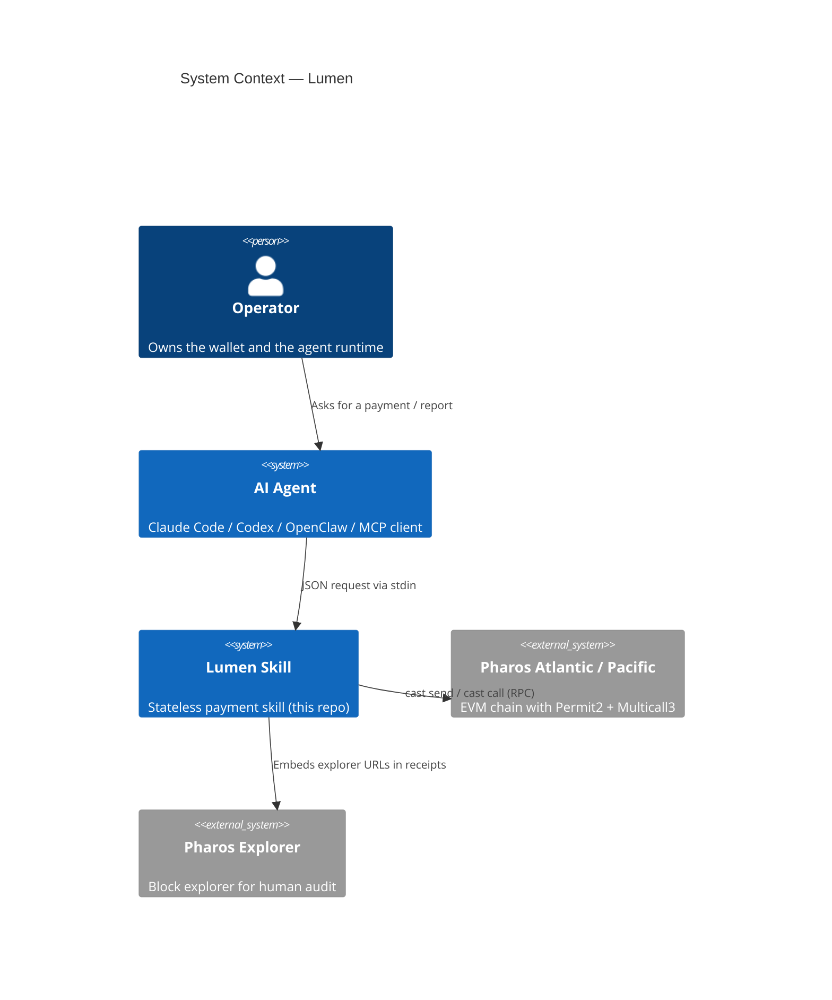
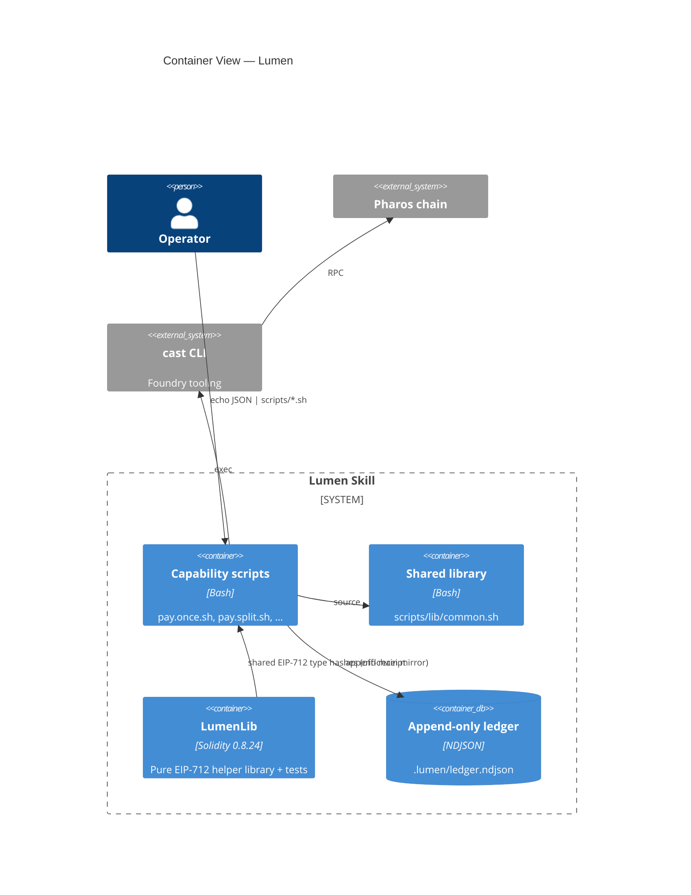
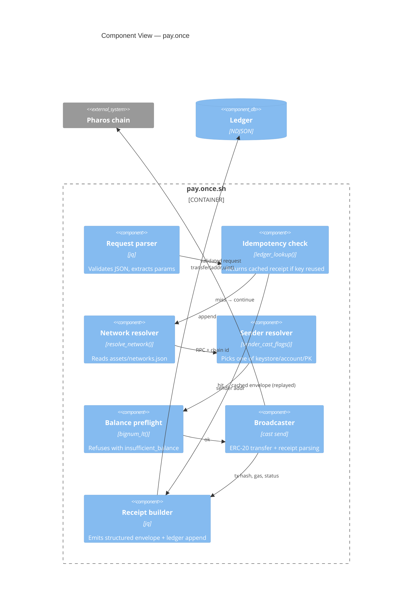
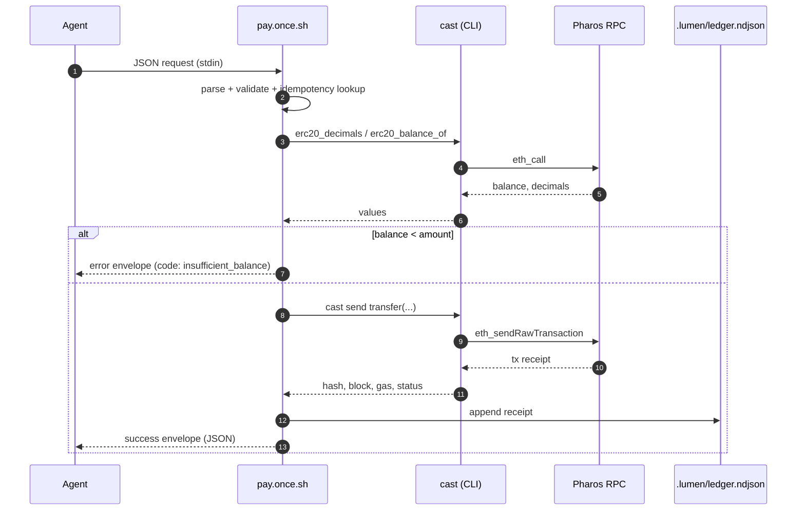
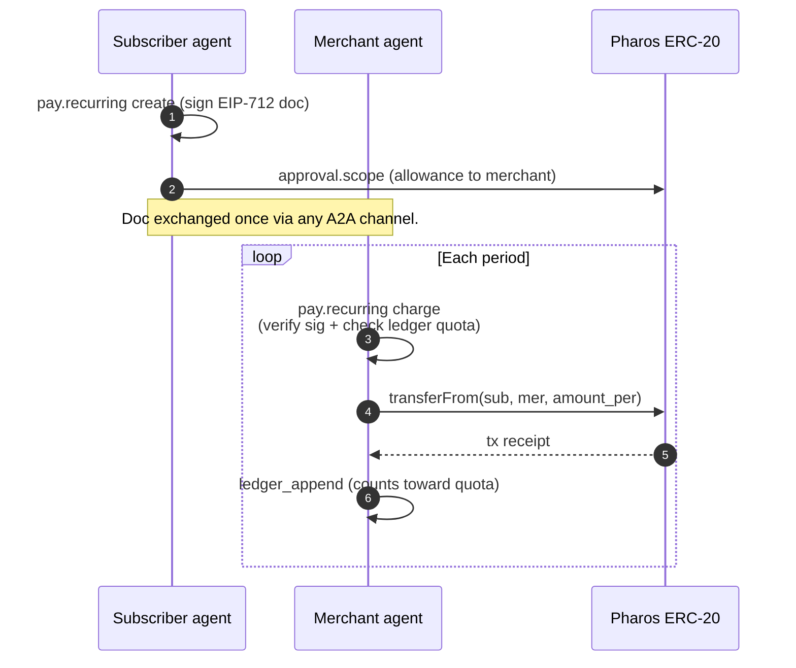

# Lumen Architecture

This document describes Lumen at three C4 levels — System Context, Container,
Component — followed by the canonical payment flow sequences.

## 1. System Context

Lumen lives at the boundary between *an AI agent* and *the Pharos chain*. It
never holds funds, never deploys contracts, and never exposes a public
endpoint. The agent invokes Lumen as a local skill; Lumen invokes Pharos via
the user's chosen RPC.

## 2. Container View

Inside the Lumen process we have four containers: capability scripts (the
public surface), a shared bash library, a pure Solidity helper library, and
the local ledger.

## 3. Component View — typical payment

Zoom into `scripts/pay.once.sh` to see how a single payment is broken into
six components.

## 4. Canonical payment flow

The "happy path" for a `pay.once`:

## 5. Recurring-payment trust model

The single most subtle flow — see `references/pay.recurring.md` for the
narrative version:

## Why no custom contract?

Lumen could ship a `LumenEscrow.sol` and `LumenRecurringHub.sol`. It does
**not**. The pillar is that *every primitive can be assembled from existing
canonical contracts on Pharos*:

- Single transfers — ERC-20 `transfer` / `transferFrom`
- Batched atomic settlement — Multicall3.`aggregate3`
- Scoped approvals — Permit2.`approve`
- Pre-signed authorisations — EIP-712 with off-chain ledger enforcement

This eliminates an entire class of failure modes (upgrade governance, admin
keys, paused contracts) and reduces the audit surface to the **scripts**
themselves.
