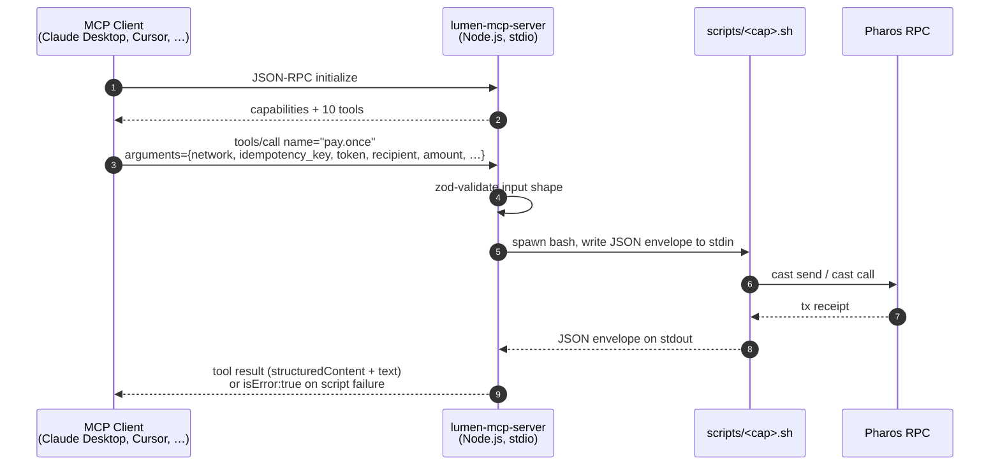

# Lumen as an MCP Server

Lumen ships a [Model Context Protocol](https://modelcontextprotocol.io) server
under `mcp-server/` that exposes every Lumen capability as an MCP tool. This
is the fourth distribution target listed in `SKILL.md` (Claude Code, Codex CLI,
OpenClaw, **MCP**) — same source tree, one extra `npm run build` away.

## Why a separate runtime?

Claude Code, Codex CLI, and OpenClaw all run the bash capability scripts
directly because they understand the Anthropic skill manifest. MCP clients
(Claude Desktop, Cursor, VS Code agent mode, custom MCP hosts) only know how
to call MCP tools — they do not execute arbitrary shell scripts. The
`mcp-server` package is the smallest possible adapter that turns each
`scripts/*.sh` into a typed MCP tool with the **same name** as the capability.

## Architecture



The MCP layer is **deliberately thin**. Every Lumen policy (refusing
`uint256.max`, mainnet private-key refusal, 365-day windows, tip caps,
signature verification, ledger replay) lives in the bash script. The MCP
server only validates the input *shape* with zod so the agent gets a fast
schema error instead of paying a process-spawn round trip.

## Tools exposed

| Tool name          | Tier | Underlying script             | What it does                                       |
|--------------------|------|-------------------------------|----------------------------------------------------|
| `pay.once`         | P0   | `scripts/pay.once.sh`         | Single ERC-20 transfer                             |
| `pay.split`        | P0   | `scripts/pay.split.sh`        | Multi-recipient sequential or Multicall3 split     |
| `approval.scope`   | P0   | `scripts/approval.scope.sh`   | Bounded ERC-20 / Permit2 approval                  |
| `receipt.generate` | P0   | `scripts/receipt.generate.sh` | Decode any tx into MD/JSON/CSV receipts            |
| `invoice`          | P1   | `scripts/invoice.sh`          | EIP-712 invoice issue/verify/pay                   |
| `pay.recurring`    | P1   | `scripts/pay.recurring.sh`    | Stateless recurring payments                       |
| `ledger.query`     | P1   | `scripts/ledger.query.sh`     | Local + on-chain payment lookup                    |
| `pay.escrow`       | P2   | `scripts/pay.escrow.sh`       | Hash-locked A2A escrow                             |
| `pay.tip`          | P2   | `scripts/pay.tip.sh`          | A2A micropayments (direct or ticket)               |
| `intent.parse`     | P2   | `scripts/intent.parse.sh`     | NL → capability request mapper                     |

The tool input schema for each is the capability's `params` object plus the
two optional envelope fields `network` and `idempotency_key`. See
`references/<capability>.md` for the per-tool schema.

## Quick start

```bash
cd mcp-server
npm install
npm run build

# Smoke test: initialize + intent.parse, no wallet required.
(
  printf '%s\n' \
    '{"jsonrpc":"2.0","id":1,"method":"initialize","params":{"protocolVersion":"2024-11-05","capabilities":{},"clientInfo":{"name":"smoketest","version":"0.0.1"}}}' \
    '{"jsonrpc":"2.0","method":"notifications/initialized","params":{}}' \
    '{"jsonrpc":"2.0","id":2,"method":"tools/call","params":{"name":"intent.parse","arguments":{"utterance":"send 10 USDC to 0x70997970C51812dc3A010C7d01b50e0d17dc79C8","default_token":"0xA0b86991C6218B36c1d19D4a2e9Eb0cE3606eB48"}}}'
  sleep 0.3
) | node dist/index.js
```

You should see the initialize result followed by an `intent.parse` envelope
whose `best_match.capability == "pay.once"`.

## Wiring into Claude Desktop

Edit `~/Library/Application Support/Claude/claude_desktop_config.json`:

```json
{
  "mcpServers": {
    "lumen": {
      "command": "node",
      "args": ["/ABS/PATH/TO/lumen/mcp-server/dist/index.js"],
      "env": {
        "LUMEN_NETWORK": "atlantic",
        "LUMEN_KEYSTORE": "/Users/me/.lumen/keys/sender.json"
      }
    }
  }
}
```

Restart Claude Desktop. The Lumen tools appear under the `lumen` server.
Mutating tools trigger Claude Desktop's confirmation dialog *before* the bash
script broadcasts — the human stays in the loop.

## Wiring into Cursor / Claude Code / VS Code

Create `.cursor/mcp.json` (or the equivalent for your client):

```json
{
  "servers": {
    "lumen": {
      "type": "stdio",
      "command": "node",
      "args": ["/ABS/PATH/TO/lumen/mcp-server/dist/index.js"]
    }
  }
}
```

## Environment variables

The MCP server inherits the environment of the spawning process. The variables
that matter to Lumen:

| Variable                                                       | Default                                  | Purpose                                                                       |
|----------------------------------------------------------------|------------------------------------------|-------------------------------------------------------------------------------|
| `LUMEN_SCRIPTS_DIR`                                            | `../scripts` relative to `dist/`         | Override when running the server outside the repo.                            |
| `LUMEN_NETWORK`                                                | *(unset)*                                | Default Pharos network used by tools that omit `network`.                     |
| `LUMEN_KEYSTORE` / `LUMEN_ACCOUNT` / `LUMEN_PRIVATE_KEY`       | *(unset)*                                | Sender resolution. Raw private keys are refused on mainnet.                   |
| `LUMEN_RPC_URL`                                                | from `assets/networks.json`              | Override the RPC endpoint.                                                    |

## Failure modes

- **Schema error** (zod): the MCP client receives a protocol-level validation
  error before the bash script is spawned.
- **Structured Lumen error**: the bash script wrote a
  `{status:"error", error:{code, message, details}}` envelope. The MCP tool
  returns that envelope verbatim with `isError: true` and the agent can
  branch on `error.code`.
- **Spawn / parse failure**: bash crashed before printing valid JSON. The
  server synthesises an envelope with `error.code = "script_failure"` or
  `"envelope_parse_failed"`, tails of stderr / stdout for diagnostics, and
  `isError: true`.
- **Timeout**: scripts that exceed 120s (default) are SIGTERMed and return
  exit code 124.

## Files

- `mcp-server/src/index.ts` — stdio transport entry point.
- `mcp-server/src/server.ts` — builds the `McpServer`, registers all 10 tools.
- `mcp-server/src/runner.ts` — spawns bash + parses the JSON envelope.
- `mcp-server/src/tools/<capability>.ts` — one zod schema per capability.
- `mcp-server/README.md` — developer-facing setup / smoke-test instructions.
