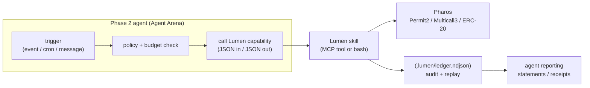

# Lumen — Phase 2 Agent Mockups

Lumen is intentionally a **skill**, not an app. Phase 1 ships the payment
primitives; Phase 2 is where autonomous agents *compose* those primitives into
products. This document sketches five concrete agents that drop straight onto
the Phase 1 capabilities with **no new on-chain infrastructure** — each is just
orchestration on top of the existing Lumen JSON contract.

Every agent below reuses the same guarantees Phase 1 already provides:
idempotency keys, the append-only `.lumen/ledger.ndjson`, deterministic error
codes, and zero custom contracts (Permit2 + Multicall3 + EIP-712 only).

## How Phase 2 agents consume Lumen

The agent owns *when* and *why* to pay; Lumen owns *how* to pay safely.

## 1. Lumen Treasury Agent

Auto-pays incoming invoices subject to per-vendor budget caps and produces
monthly statements.

- **Trigger:** a new EIP-712 invoice document arrives (A2A message, webhook, or
  inbox poll).
- **Lumen capabilities:** `invoice action=verify` → policy check → `pay.once`
  (or `pay.split` for multi-line invoices) → `receipt.generate`. Monthly close
  runs `ledger.query` + `receipt.generate` over the period.
- **Data flow:** invoice in → budget/allow-list gate in the agent → payment via
  Lumen → receipt + ledger entry out. Repeated invoice IDs map to a stable
  `idempotency_key`, so a double-delivered invoice never double-pays.
- **No new on-chain infra:** budgets and vendor allow-lists are agent-side
  policy; settlement is a plain ERC-20 transfer.

## 2. Royalty Splitter Agent

Splits incoming revenue across a configured basis-point table the moment it
lands.

- **Trigger:** an ERC-20 `Transfer` event to a designated treasury wallet.
- **Lumen capabilities:** `approval.scope mode=permit2` (one-time Multicall3
  budget) → `pay.split mode=multicall` so the entire split settles atomically
  in a single transaction an indexer can treat as one event.
- **Data flow:** incoming transfer → agent reads the configured split table →
  one atomic Multicall3 payout → ledger records the full allocation table for
  later `ledger.query` audits.
- **No new on-chain infra:** the split is composed from Multicall3; the BPS
  table lives in agent config, validated against `LumenLib` share math.

## 3. Subscription Manager Agent

Drives recurring authorizations for any service that accepts on-chain billing.

- **Trigger:** a cron schedule (e.g. monthly) plus an active `pay.recurring`
  authorization.
- **Lumen capabilities:** `pay.recurring action=authorize` once, then
  `pay.recurring action=charge` on each cycle, bounded by the EIP-712
  authorization window and amount.
- **Data flow:** authorize (signed once) → scheduled charges within the signed
  cap → `receipt.generate` per charge → cancel by letting the authorization
  expire (no on-chain revoke transaction required).
- **No new on-chain infra:** the authorization is an EIP-712 document verified
  against the `LumenLib` digest; cycles are agent-scheduled.

## 4. Bounty Custodian Agent

Issues and settles tip/bounty claim tickets for a public board.

- **Trigger:** a maintainer marks a bounty as earned, or a claim ticket is
  redeemed.
- **Lumen capabilities:** `pay.tip action=issue` to mint an EIP-712 claim
  ticket, `pay.tip action=send` to settle it (subject to the built-in
  single-tip ceiling).
- **Data flow:** issue ticket (off-chain signed doc) → claimant redeems →
  agent verifies and calls `pay.tip` → ledger + receipt. Tickets are portable
  between agents with no central server.
- **No new on-chain infra:** tickets are signed documents; settlement is a
  capped ERC-20 transfer.

## 5. Escrow-Marketplace Agent

Coordinates two-party conditional payments for a simple marketplace.

- **Trigger:** buyer and seller agree on terms; buyer funds an escrow offer.
- **Lumen capabilities:** `pay.escrow action=offer` (hash-locked) →
  `pay.escrow action=release` on condition met, or expiry-based refund — all
  from one signature, one bounded allowance, and the local ledger.
- **Data flow:** offer (signed) → buyer funds within a bounded allowance →
  release on proof, or auto-refund after expiry → receipts for both legs.
- **No new on-chain infra:** no custodian contract; the escrow is composed from
  a bounded approval plus EIP-712 offer/claim documents.

## Why this matters for judging

These mockups demonstrate **reusability and vision alignment** concretely: each
Phase 2 product is a thin orchestration layer, and because Lumen ships as four
runtimes (Claude Code, Codex CLI, OpenClaw, MCP) from one source tree, an
Agent Arena team can pick whichever runtime fits without forcing the ecosystem
into a single tooling silo.

See [`HACKATHON.md`](./HACKATHON.md) for the full Phase 1 judging-criteria
mapping and [`ARCHITECTURE.md`](./ARCHITECTURE.md) for the system diagrams.
