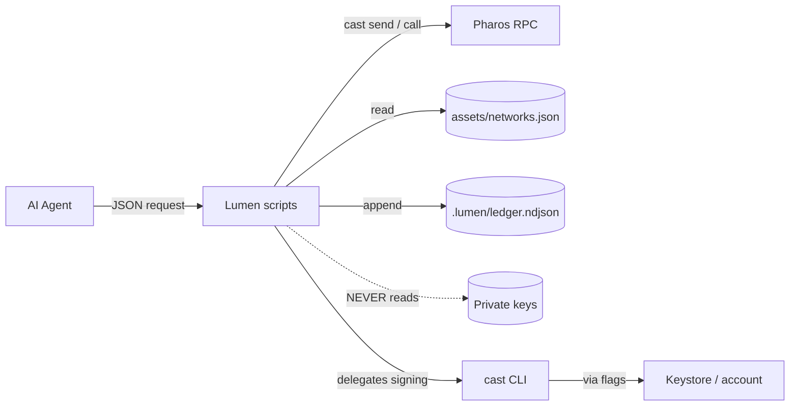

# Lumen Security & Autonomy

This document maps each plausible threat against the skill to a mitigation
already enforced by the code. Lumen is designed to ship clean through the
**CertiK Skill Scanner** and to give the operator confidence when granting an
agent autonomous control of a wallet.

## Trust boundaries

- Lumen scripts **never** read a private key directly. Signing flows through
  `cast` and the user-configured keystore / account / (testnet-only) PK env.
- The only external traffic is to the RPC URL listed in `assets/networks.json`
  (or `$LUMEN_RPC_URL`). No analytics, no telemetry, no third-party hosts.

## Threat → mitigation matrix

| # | Threat | Mitigation | Where enforced |
|---|---|---|---|
| T1 | Agent grants unlimited (`uint256.max`) approval | Refused with `policy_unlimited_approval` | `approval.scope.sh` |
| T2 | Agent grants long-lived approval (years) | Window capped at 365 days | `approval.scope.sh` |
| T3 | Agent forgets to set an expiry | `expiry_unix` is mandatory | `approval.scope.sh` |
| T4 | Agent uses a raw private key against mainnet | `policy_violation` error before any RPC call | `pay.once.sh`, `pay.split.sh`, `approval.scope.sh` |
| T5 | Replay of the same payment after retry | Idempotency-key lookup in `.lumen/ledger.ndjson` | every mutation script |
| T6 | Recurring plan billed twice in same period | Last charge timestamp + `periodSeconds` check | `pay.recurring.sh action=charge` |
| T7 | Merchant exceeds `maxPeriods` cap | Ledger count vs `maxPeriods` check | `pay.recurring.sh action=charge` |
| T8 | Forged invoice / recurring doc | EIP-712 signature recovery via `cast wallet recover` | `invoice.sh action=verify`, `pay.recurring.sh action=verify` |
| T9 | Wrong payer attempts to settle a signed invoice | `wrong_payer` check before `pay.once` is invoked | `invoice.sh action=pay` |
| T10 | Malicious JSON injection through input | All inputs flow through `jq -e` parsers and bash variables; no `eval`, no `bash -c $INPUT` | every script |
| T11 | Receipt ledger tampering | NDJSON is append-only; idempotency lookup uses `tail -n 1` over filtered records (latest wins) | `lib/common.sh` |
| T12 | Multicall3 aggregator pulls more than budgeted | `pay.split mode=multicall` reads current allowance and refuses if < total | `pay.split.sh` |
| T13 | Wide RPC-log scan exhausts public RPC | `ledger.query` exposes `from_block` / `to_block` / `limit` knobs | `ledger.query.sh` |
| T14 | Address case mismatch causing replay | All comparisons lower-case via `to_lower_address` | `lib/common.sh` |

## Autonomy posture

Lumen is designed so an agent can run **fully autonomous** within the
following envelope without operator review per call:

- ERC-20 amounts whose **total ≤ pre-budgeted approval window** for the
  configured spender / merchant.
- Networks listed in `assets/networks.json` only.
- No call may bypass the structured JSON envelope.

Operators wanting tighter control can:

1. Set `LUMEN_NETWORK=atlantic` for safe testing.
2. Run with a `cast wallet` account whose keystore requires a password each
   invocation.
3. Wrap Lumen scripts in their own pre-flight (e.g. an MCP allow-list).

## Out of scope

Lumen does **not** attempt to mitigate:

- Operator-level wallet compromise (any of: lost seed phrase, malware on the
  host, social engineering of the operator).
- A malicious RPC provider returning false event logs (Lumen surfaces the RPC
  URL in every receipt for cross-check via explorer).
- Token-contract bugs (e.g. an ERC-20 that ignores `transfer` return value).
- Network-level censorship / mempool privacy.

## Responsible disclosure

Found a security issue? Open a private security advisory on the project's
GitHub mirror — or DM the maintainer in the Pharos hackathon channel. **Do
not** open a public issue with proof-of-concept exploit details.

We commit to a 7-day triage SLA during the hackathon and a 30-day patch SLA
post-launch.
