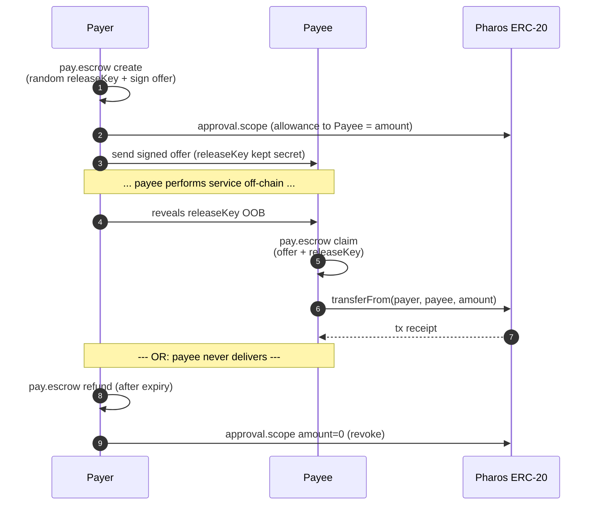

# `pay.escrow` — Stateless Hash-Locked Escrow

Two-party escrow with **no custodian, no custom contract**, no admin keys.
Built from one EIP-712 signed offer + one bounded allowance + Lumen's audit
ledger.

## How it works



The releaseKey acts as a **bearer secret**: whoever holds both the signed
offer and the releaseKey can claim. The payer's allowance to the payee is the
on-chain trust anchor.

## Actions

| Action | Caller | Effect |
|---|---|---|
| `create` | Payer | Generates a random `releaseKey`, signs an `EscrowOffer`, returns offer + releaseKey |
| `verify` | Anyone | Off-chain signature recovery |
| `claim`  | Payee  | Verifies offer + releaseKey, executes `transferFrom(payer, payee, amount)` |
| `refund` | Payer  | After expiry, records refund; payer should revoke allowance with `approval.scope` |

## Request schema

```json
{
  "network": "atlantic | pacific",
  "params": {
    "action": "create | verify | claim | refund",

    "payee":       "0x… (create)",
    "token":       "0x… (create)",
    "amount":      "string (create)",
    "expiry_unix": 1750000000,
    "memo":        "string (optional)",
    "escrow_id":   "0x… 64-hex (optional)",
    "release_key": "0x… 64-hex (create-optional; claim-required)",

    "document":    { /* signed offer (verify, claim, refund) */ }
  }
}
```

## Successful `create` response

```json
{
  "status": "ok",
  "capability": "pay.escrow",
  "result": {
    "action": "create",
    "document": {
      "escrowId": "0x…",
      "payer": "0x…", "payee": "0x…",
      "token": "0x…", "amount": "1000000",
      "releaseKeyHash": "0x…",
      "expiry": 1750000000,
      "memo": "Q3 design deliverable",
      "chainId": 688689,
      "signature": "0x…"
    },
    "release_key": "0x… (32-byte bearer secret)",
    "release_key_warning": "release_key is the bearer secret — share it OOB only after the payee delivers."
  }
}
```

## Error codes

| `error.code` | Trigger |
|---|---|
| `missing_param` / `invalid_action` | Bad request |
| `expiry_in_past` / `window_too_long` | Expiry policy ceiling |
| `invalid_release_key` / `invalid_escrow_id` | Wrong hex shape |
| `hash_failed` / `sign_failed` | Wallet signing problem |
| `signature_mismatch` | Recovered signer ≠ `payer` |
| `release_key_mismatch` | `keccak256(releaseKey) ≠ releaseKeyHash` |
| `escrow_expired` | `claim` after `expiry` |
| `not_yet_expired` | `refund` before `expiry` |
| `wrong_payer` / `wrong_payee` | Caller wallet ≠ document role |
| `insufficient_allowance` | Payer's allowance to payee < amount |
| `tx_send_failed` | `transferFrom` broadcast failed |

## Example: deal between two agents

```bash
# Payer
OUT=$(echo '{
  "network":"atlantic",
  "params":{
    "action":"create",
    "payee":"0xPAYEE…",
    "token":"0xUSDC…",
    "amount":"500000",
    "expiry_unix":'"$(($(date +%s)+604800))"',
    "memo":"design deliverable"
  }
}' | scripts/pay.escrow.sh)

# Extract the offer doc + release key.
OFFER=$(jq '.result.document' <<<"$OUT")
RK=$(jq -r '.result.release_key' <<<"$OUT")

# Payer also pre-authorises the payee allowance:
echo "{
  \"params\":{
    \"token\":\"0xUSDC…\",
    \"spender\":\"0xPAYEE…\",
    \"amount\":\"500000\",
    \"expiry_unix\":$(($(date +%s)+604800))
  }
}" | scripts/approval.scope.sh

# … service delivered, payer shares RK with payee …

# Payee
echo "{
  \"network\":\"atlantic\",
  \"params\":{
    \"action\":\"claim\",
    \"document\":$OFFER,
    \"release_key\":\"$RK\"
  }
}" | scripts/pay.escrow.sh
```

## Notes

- The releaseKey is **never** persisted in the ledger; only the offer doc and
  receipts are. Loss of releaseKey means the payee cannot claim — the
  escrow effectively expires.
- `claim` is idempotent via the `escrow-claim-<escrowId>` key, so a re-run
  returns the cached transfer receipt rather than firing a second
  transferFrom.
- For multi-party escrow (more than one payee), issue N separate offers with
  distinct releaseKeys.
