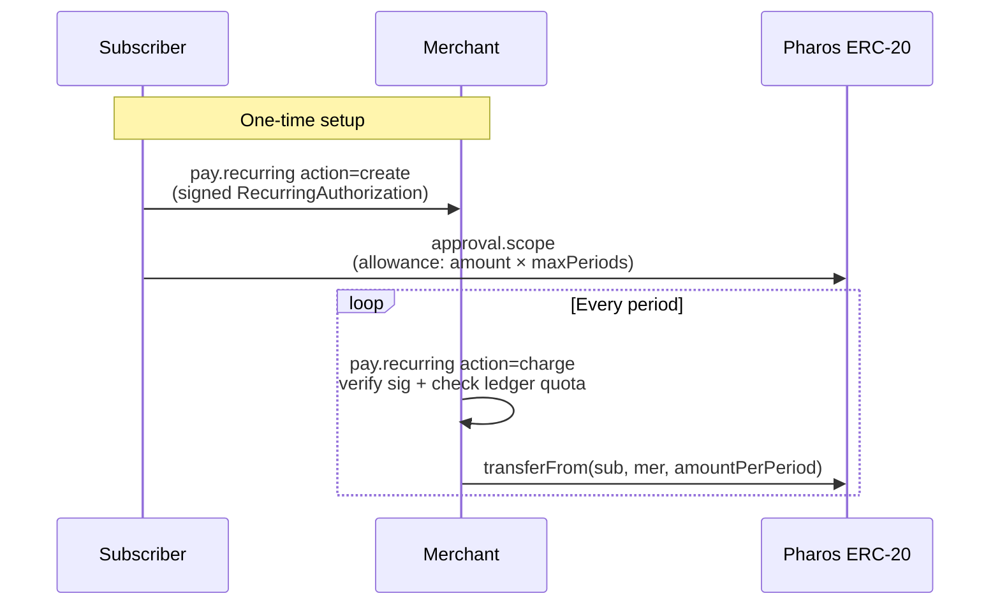

# `pay.recurring` — Stateless Recurring Payments

Subscriptions and instalments **without** deploying a custom contract.

## Trust model



The signed `RecurringAuthorization` doc defines the spending envelope. The
*existing* ERC-20 allowance is the on-chain trust anchor. The Lumen ledger
enforces "one charge per period, no more than `maxPeriods` total" — no smart
contract needed.

## Actions

| Action | Caller | Description |
|---|---|---|
| `create` | Subscriber | Sign the EIP-712 doc and return it |
| `verify` | Anyone | Off-chain signature recovery |
| `charge` | Merchant | Verify + enforce quota + transferFrom |

## Request schema

```json
{
  "network": "atlantic | pacific",
  "params": {
    "action": "create | verify | charge",

    "merchant":         "0x… (create)",
    "token":            "0x… (create)",
    "amount_per_period":"string (create)",
    "period_seconds":   86400,
    "start_at_unix":    1750000000,
    "end_at_unix":      1782000000,
    "max_periods":      12,
    "plan_id":          "0x… 64-hex (create, optional)",

    "document": { /* signed doc (verify, charge) */ }
  }
}
```

## Authorization document shape

```json
{
  "planId":           "0x… (bytes32)",
  "subscriber":       "0x…",
  "merchant":         "0x…",
  "token":            "0x…",
  "amountPerPeriod":  "1000000",
  "periodSeconds":    2592000,
  "startAt":          1750000000,
  "endAt":            1782000000,
  "maxPeriods":       12,
  "chainId":          688689,
  "signature":        "0x…"
}
```

## Successful response (charge)

```json
{
  "status": "ok",
  "result": {
    "action": "charge",
    "authorization": { /* doc */ },
    "charge": {
      "capability": "pay.recurring",
      "plan_id": "0x…",
      "subscriber": "0x…", "merchant": "0x…",
      "token": "0x…", "amount": "1000000",
      "period_number": 4, "max_periods": 12,
      "charged_at_unix": 1751000000,
      "tx": { "...": "..." }
    }
  }
}
```

## Policy ceilings

- `end_at_unix - start_at_unix ≤ 365 days` (matches `approval.scope`).
- `max_periods ≤ 366` (daily-for-a-year ceiling).
- `period_seconds > 0` (otherwise the merchant could drain in a tight loop).
- A `max_periods == 0` plan is "open-ended within the window"; the quota
  check still enforces `period_seconds` between charges.

## Error codes

| `error.code` | Trigger |
|---|---|
| `missing_param` / `invalid_action` | Bad request |
| `invalid_period` / `invalid_window` | `period_seconds == 0` or `end <= start` |
| `window_too_long` / `max_periods_too_high` | Policy ceilings |
| `hash_failed` / `sign_failed` | Wallet cannot produce signature |
| `signature_mismatch` | Recovered signer ≠ `subscriber` |
| `plan_not_started` / `plan_ended` | Outside `[startAt, endAt]` |
| `max_periods_exhausted` | All allowed periods already charged |
| `period_not_due` | Last charge was too recent |
| `wrong_merchant` | Charging wallet ≠ `document.merchant` |
| `tx_send_failed` | `transferFrom` broadcast failed |

## Notes

- Period spacing is enforced **strictly** against the last successful charge
  recorded in `.lumen/ledger.ndjson`. To grant a "make-up" charge, the
  subscriber must sign a new plan.
- Because each charge is itself idempotent
  (`charge-<planId>-<periodNumber>`), running `pay.recurring action=charge`
  twice in the same period is a no-op — the second call returns the cached
  receipt.
- The merchant must have an allowance from the subscriber covering at least
  `amount_per_period × max_periods`. The recommended pattern is
  `approval.scope mode=direct expiry_unix=endAt amount=<budget>`.
